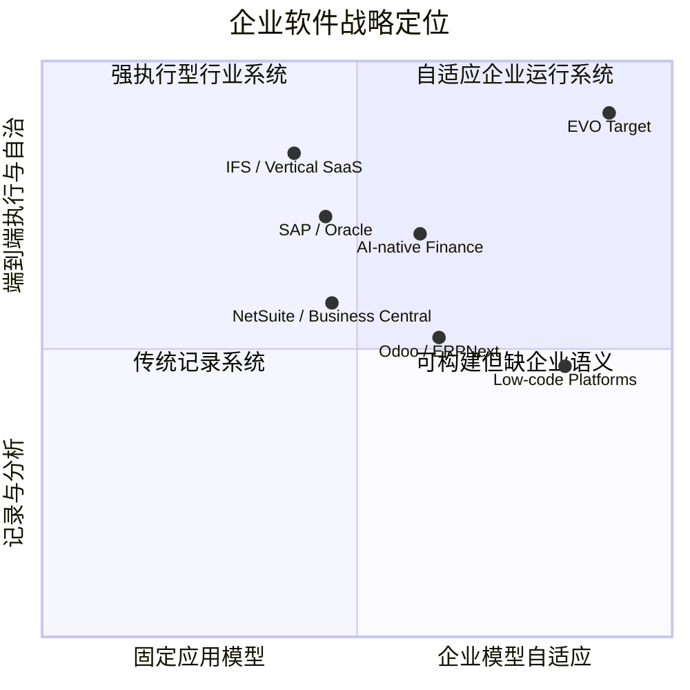
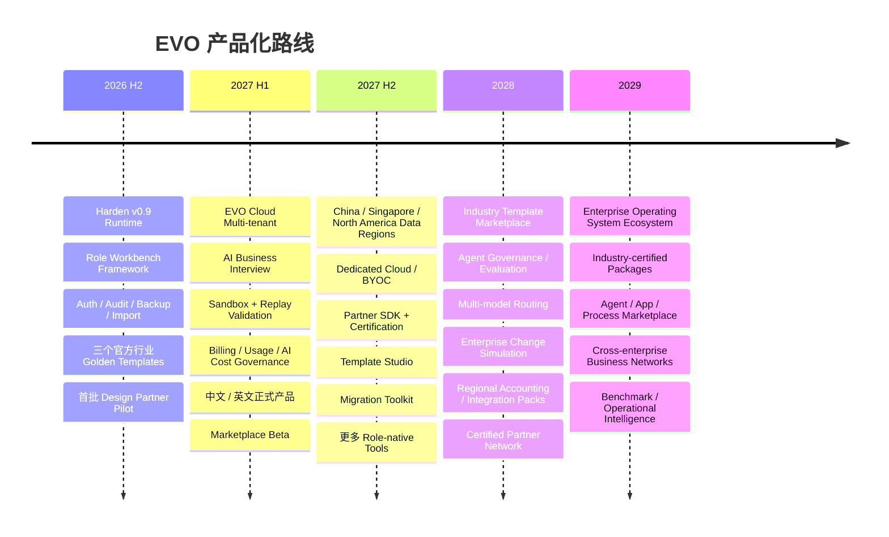

# EVO 市场定位与商业模式深度研究报告

## 前提与假设

本报告基于截至 **2026 年 9 月 10 日**的公开市场资料，并结合此前已经形成的 EVO 产品与架构方向进行判断。以下首先区分“你已经明确的前提”和“为了完成商业分析而补充的假设”，避免把战略建议误写成既定事实。

| 类型 | 前提 / 假设 |
|---|---|
| 已知前提 | EVO 的长期定位是 **AI-Native Enterprise Operating System**，而不是传统 ERP 的 AI 增强版。 |
| 已知前提 | EVO 已经形成 Metadata、Application/Template/Overlay、Command、BusinessData、Posting、Ledger、Cost、Replay、Workflow/WorkItem、AI Gateway、Integration、Query、Permission 等核心架构思想。 |
| 已知前提 | 人与 AI 原则上通过同一业务 Command 边界执行操作，AI 不拥有绕过业务规则的“特殊通道”。 |
| 已知前提 | EVO 强调历史不覆盖、规则版本化、可重放、可迁移、可灰度和可审计，因此目标不是“AI 帮企业填表”，而是允许企业在可控条件下持续改变自身运行系统。 |
| 已知前提 | 目标市场全球化，以中英文市场为主；初始销售区域为中国、东南亚、北美；客户价格敏感度中等。 |
| 已知前提 | 你最新提出了一个非常重要的产品原则：**老板关心企业整体与管理，一线员工关心软件作为工具是否好用。** |
| 未指定假设 | 初期团队仍然相对精干，因此不能采用 SAP 式大规模实施团队模式，必须产品化实施。 |
| 未指定假设 | EVO 初期不强求一次性取代当地法定会计、税务、薪资等全部系统；可以先成为运营“根系统”，与现有财务/税务系统集成，再逐步扩大边界。 |
| 未指定假设 | 默认 Cloud-first，但从产品设计第一天保留 Dedicated Cloud、BYOC/VPC、私有化和客户自选模型能力。 |
| 未指定假设 | 以下收入数字统一以美元计价，是**创始团队经营模型，不是市场预测或融资承诺**；实施顾问收入原则上不作为核心 SaaS 毛利来源。 |

## 执行摘要

EVO 最值得占领的市场位置不是“另一个 AI ERP”，而是 **Adaptive Enterprise Operating System——企业管理根系统 + 企业工作工具生成平台**：市场已经证明 AI 正快速进入企业软件，但“装上 AI”本身正在迅速商品化——SAP 已把 Joule Agents 引入企业流程，Oracle 正将 Fusion 重构为 agentic applications，Microsoft 把 Copilot/Agent 能力嵌入 Business Central 与 Power Platform，NetSuite 也把 AI 推向其下一代 ERP；与此同时，Rillet、DualEntry、Campfire、Light 等 AI-native 厂商正在集中攻击财务和月结场景。citeturn22search1turn22news27turn19view1turn22search2 更关键的是，McKinsey 2026 调查显示，企业 AI 使用已经非常广泛，但真正获得显著 EBIT 贡献的仍是少数，高绩效企业与普通企业最明显的差异之一是**重构工作流，而不是简单部署 AI 工具**；同一调查还发现约三分之一受访企业曾因 agentic coding 能自行构建软件而放弃购买某些商业软件。citeturn12view0 这意味着 EVO 的机会不在“AI 功能更多”，而在于把 **企业模型、业务历史、账本、流程、工作、AI 执行和变化管理统一为一个可演化运行时**。建议首个 ICP 聚焦 **50–1000 人、业务复杂度已经超过 Excel/单点 SaaS、但又不愿承担 SAP/Oracle 级实施成本的成长型企业**，优先进入跨境贸易/分销、轻制造、多实体服务/科技三个场景；产品必须采用“三层体验”：**老板看到企业，中层看到业务流与异常，一线员工只看到最好用的工作工具**。商业上建议以“平台订阅 + 透明 AI 消耗 + 托管云 + Marketplace 分成”为主模型，同时保留高 ACV 的 Sovereign Enterprise 版本；不开纯 token 价格战，也不把 seat tax 作为核心收费逻辑。按照本文的基准经营模型，主方案在第 3 年约可形成 **$7.5M ARR**、第 5 年约 **$50.6M ARR**，但真正决定 EVO 是否成立的首要指标不是 ARR，而是能否在首批客户中证明：**上线快、业务改变快、一线真的愿意用、管理层真的因此看清企业，而且 AI 能安全地执行而不是只聊天。**

## 市场机会与目标客户

企业 AI 市场现在有一个对 EVO 非常有利、同时也非常危险的窗口。McKinsey 2026 的全球调查显示，接近九成受访组织已在至少一个职能中经常使用 AI，44% 表示正在企业级扩展，但只有约 37% 把某种 EBIT 改善归因于 AI，约 6% 属于获得显著 EBIT 贡献的高绩效群体；这些高绩效企业更常进行根本性的工作流重构。citeturn12view0 中国市场的底层模型使用量同样在急剧放大：IDC 2026 年发布的中国 MaaS 数据显示，其统计口径下企业级 MaaS 调用量从 2024 年约 114 万亿 Tokens 上升至 2025 年约 1944 万亿 Tokens，同比增长约 16 倍；这并不等于 ERP 需求增长 16 倍，但至少说明“企业没有模型可用”已经越来越不是主要约束。citeturn25search1

因此，我认为 EVO 的核心商业判断应当是：

> **未来企业软件最稀缺的不是模型，而是“可被 AI 安全理解和执行的企业本身”。**

模型会继续变便宜、变强；企业自己的业务语义、规则、历史、权限、账本、流程和责任边界才是难以替代的资产。

### 建议的目标客户画像

| 细分客户 | 建议规模 | 当前典型状态 | 核心痛点 | 采购发起人 / 决策链 | 最重要的采购 KPI | EVO 契合度 |
|---|---:|---|---|---|---|---|
| **跨境贸易、品牌分销、多渠道电商运营** | 50–500 人 | ERP + Shopify/Amazon/平台店 + WMS/3PL + Excel + 财务软件 | 订单、库存、采购、物流、应收之间割裂；多公司、多币种、多国家；异常大量靠人盯 | Owner/CEO → COO/供应链负责人 → CFO → IT/安全 → 财务/仓库/销售 | 订单周期、OTIF、库存准确率、缺货率、现金转换周期、人工对账时间 | **最高** |
| **轻制造 / 装配 / OEM / ODM** | 100–1000 人 | ERP + MES/Excel + 仓库系统 + 手工排产 | 销售订单到生产/采购断裂；在制品不可见；计划频繁变化；成本追溯困难 | CEO/COO → 厂长/供应链 → CFO → IT → 生产/仓库 | 计划达成率、在制品、库存周转、交付周期、返工率、成本偏差 | **最高** |
| **多实体科技、专业服务、项目型企业** | 50–500 人 | CRM + 项目系统 + 工时 + 财务 + Excel | 从合同到交付到收入确认数据不一致；项目盈利性滞后；跨实体结算复杂 | CEO/CFO → COO/交付负责人 → Finance/IT | 项目毛利、利用率、DSO、收入确认周期、月结周期、审批周期 | **高** |
| 资产/现场服务企业 | 200–2000 人 | ERP + FSM/EAM + 调度工具 | 资产、技师、备件、合同、计费高度耦合 | COO → 服务 VP → CIO/CFO | 首次修复率、技师利用率、SLA、备件、服务毛利 | 中长期高 |
| 超小企业 | <20–30 人 | Excel + QuickBooks/Xero/Odoo 等 | 预算敏感，流程尚不复杂 | Owner | 价格、简单、立即可用 | **初期不建议主攻** |
| 大型集团 | >2000 人 | SAP/Oracle/用友等核心 ERP + 大量外围系统 | 复杂集成、治理、历史系统 | CIO/CFO/COO + Procurement + Security + Legal | 风险、SLA、合规、TCO、集成、迁移 | **后期进入** |

这里的 **50–1000 人**不是市场统计结论，而是我对 EVO 初期 ICP 的战略选择。原因是，两端都不理想：低端已经有 Odoo、ERPNext 和大量低价 SaaS；高端则有 SAP、Oracle、IFS 等成熟产品、咨询生态和巨大的组织性采购壁垒。ERPNext 本身就是完整的开源 ERP，官方强调软件可自由获取和修改；Odoo 则用 One App Free、按用户订阅及庞大 App 生态降低中小企业进入门槛。citeturn4view2turn20search1

AI-native ERP 新公司目前也证明了“中型企业正在重新评估 ERP”这一方向。例如 DualEntry 的公开市场定位明显瞄准正在超越 QuickBooks、但对传统 ERP 迁移成本敏感的中型公司；其 2025 年融资也显示资本市场对新一代 ERP 重构存在强烈兴趣。citeturn16news2turn8view2

**建议的采购链**不是单一 CFO 销售，而是：

```text
经济买家
CEO / Owner / CFO / COO
        ↓
业务 Champion
COO / Supply Chain / Finance / Operations
        ↓
可行性 Gatekeeper
IT / Security / Data / Architecture
        ↓
风险 Gatekeeper
Finance / Audit / Legal / Procurement
        ↓
真正决定成败的人
Sales / Buyer / Planner / Warehouse / Operator / Accountant
```

这最后一层尤其重要。传统企业软件经常在“老板签单”时完成销售，却在“员工使用”时失败。EVO 的商业模型必须把**员工工具效率**也变成成交依据，否则“企业根系统”容易演化成老板喜欢的大屏，而不是企业真正运行的地方。

在区域顺序上，我建议采用 **“中国能力、东南亚桥头堡、北美价值定价”** 的组合，而不是三个市场同时复制相同销售动作。中国适合验证复杂制造、贸易和私有化；新加坡适合做中英文、多实体、东南亚区域总部和数据治理场景；北美适合验证高软件 ARPA、QuickBooks/NetSuite replacement 或 coexistence 场景。这个顺序属于 GTM 建议，而非市场份额预测。

## 竞品格局与市场定位

EVO 面临的竞争不是一个 ERP 列表，而是至少六种不同力量同时向“企业操作系统”靠拢：传统 ERP、SME 开源 ERP、AI-native finance ERP、行业专用系统、垂直 SaaS、低代码/Agent App Builder。甚至“客户自己造软件”本身也已经成为竞争者；McKinsey 2026 调查中，32% 的组织表示曾因为利用 agentic coding 可以内部构建，而决定不再购买至少一个软件产品或功能。citeturn12view0

### 核心竞品对比

> 定价为 2026 年 9 月可公开核验的信息；“询价”表示厂商未公开统一标准价。不同地区、合同期限和合作伙伴实施费用可能显著改变最终 TCO。

| 产品 | 主要功能 | 核心定位 | 部署模式 | 定价特征 | 生态 | AI 能力 | 主要客户 | 依据 |
|---|---|---|---|---|---|---|---|---|
| **SAP S/4HANA Cloud** | 财务、采购、供应链、制造、销售等 | 全球大型/复杂企业 ERP | Public / Private Cloud | 订阅制，企业询价 | **极强**：全球 SI、行业方案、BTP | Joule、Joule Agents、嵌入式 AI、流程自动化 | 中大型、跨国集团 | SAP 官方把 S/4HANA Cloud 定义为模块化、内置 AI ERP，并持续扩展 Joule Agents。citeturn10view0turn22search1 |
| **Oracle Fusion Cloud ERP** | Finance、Procurement、Projects、EPM，并连接 SCM 等 | 大中型企业 Cloud ERP | SaaS Cloud | 询价 | **极强**：Oracle/OCI/SI | 内置 AI；26B 已提供 Ledger、Expenses、Payables 等 Finance agents | 中大型、集团企业 | Oracle 官方称 Fusion ERP 是完整现代云 ERP；2026 年 ERP 已有多类 GA Finance Agent。citeturn18view0turn22search0 |
| **Microsoft Dynamics 365 Business Central** | 财务、销售、库存、供应链、制造、服务 | SME / Mid-market ERP，与 M365 紧密结合 | Cloud 为主，也有既有部署选择 | Essentials **$80/用户/月**；Premium **$110**；Team **$8**，年付 | **极强**：Microsoft Partner + AppSource + Power Platform | Copilot、Sales Order/Payables Agents，并与 Copilot Studio 配合 | SME / Mid-market | 官方当前公开价格与 Copilot/Agent 计费说明。citeturn4view0 |
| **Oracle NetSuite** | 财务、订单、库存、项目、制造、供应链、仓库等 | 一体化 Cloud ERP | 多租户 SaaS | 年度 License = Core + Module + User，另有一次性实施费；询价 | **强**：SuiteCloud、SuiteApps、Partners | NetSuite Next、suite-wide AI、AI Connector | 成长型与中型企业 | NetSuite 官方介绍其一体化 AI Cloud ERP、许可组成和伙伴生态。citeturn10view1turn22search2 |
| **Odoo** | CRM、销售、库存、制造、会计、电商、HR 等 | 模块化 SME ERP / Business Suite | SaaS、托管、自行部署体系 | One App Free；Standard/Custom 按用户/月，地区化价格 | **极强**：开源社区、Apps、Partners | AI 功能不断增强，但核心仍是模块化 Business Apps | 小微至中型公司 | Odoo 官方公开 One App Free 与 Standard/Custom 定价结构；其开源/企业双轨生态成熟。citeturn20search1turn18view1 |
| **ERPNext** | Accounting、Buying、Selling、Stock、Manufacturing、Projects、HR 等 | 开源 ERP | Self-host / Frappe Cloud | 软件本身开源免费；Hosting/Support/Implementation 另计 | **强开源生态** | AI 不是当前主要差异化核心 | SME、技术能力较强组织 | ERPNext 官方强调 100% 开源，并提供完整企业模块及 low/no-code 能力。citeturn4view2 |
| **Rillet** | GL、RevRec、多实体、报表、Close、AP/Finance automation | AI-native Finance ERP | SaaS | 未发现公开标准价，Demo/销售模式 | 金融/会计集成为主 | Aura AI、会计 Agent、异常发现、Accrual 建议、NL query | Startup、Mid-market、Enterprise finance | 官方强调 AI-native accounting、zero-day-close 方向和 embedded accounting agents。citeturn7view0turn8view3 |
| **DualEntry** | GL、AP/AR、多实体、预算、Close、Revenue、订单等 | AI ERP / 财务系统替代 | SaaS | 询价 | 大量 SaaS/数据 Integration | AI reconciliation、anomaly、close automation 等 | Mid-market、成长企业 | 官方定位为 AI ERP，并重点宣传快速迁移和月结自动化。citeturn7view1turn8view2 |
| **Campfire** | GL、Revenue、Close、Reporting、Finance automation | AI-native ERP for finance teams | SaaS | 未公开统一标准价 | 100+ native integrations 等 | 自动分类、连续 reconciliation、AI assistant、suggested actions | Lean finance / Mid-market | 官方产品把 AI 与 GL、close 和 finance automation 深度结合。citeturn8view0 |
| **Light** | Global GL、财务应用、库存、FP&A、filings 等 | AI-native global finance / operating stack | SaaS | 询价 | 会计/咨询伙伴，含 KPMG 合作 | AI-native finance automation | 国际化成长公司 | 官方强调 global ledger、模块化安装以及更自动化的财务运行方式。citeturn8view1 |
| **IFS Cloud** | ERP + EAM + FSM + Projects + Supply Chain | **行业深度型 Enterprise Operations** | Cloud | 企业询价 | 强行业/SI 生态 | IFS.ai、预测、调度、制造/资产相关智能 | 制造、航空、能源、工程、Service | IFS 官方定位聚焦制造等资产和服务密集行业，并将 AI 与运营深度结合。citeturn20search0 |
| **ServiceTitan** | CRM、报价、调度、工单、现场移动、Job Cost、Billing | **垂直 SaaS / Trades OS** | SaaS | Demo/询价 | Trades 专业生态 | Atlas AI、AI summaries、sales intelligence 等 | HVAC、Plumbing、电气、专业承包商 | 官方产品体现非常强的“岗位工具”设计：Dispatch、Scanning、Tasks、Timekeeping、移动现场工作。citeturn19view3 |
| **Microsoft Power Apps** | 自定义应用、Dataverse、Workflow、Connectors | Enterprise low-code / App platform | Cloud + on-prem connectors | Premium **$20/用户/月**；≥2000 seats **$12/用户/月** | **极强**：Azure/M365/Power Platform | Agentic features、Copilot、自然语言建 App | IT/业务开发团队 | Microsoft 当前价格页明确提供低代码 + AI + Agentic app 能力。citeturn19view1 |

这张表带来几个非常重要的结论。

**第一，AI 已经不能成为 EVO 的主差异化标签。** SAP 在卖 Joule Agents，Oracle 2026 年已经把 AI Agent 深入 Finance workflow，并开始把传统 applications 重构为 agentic applications；Microsoft、NetSuite 也都在做类似事情。citeturn22search1turn22search0turn22news27turn22search2

所以：

```text
AI ERP
```

不是一个足够强的品类。

真正值得抢的是：

```text
Enterprise model
        +
System of Record
        +
System of Action
        +
System of Work
        +
AI execution
        +
Safe evolution
```

**第二，AI-native ERP 的当前“空位”非常明显。** Rillet、DualEntry、Campfire、Light 最强的切入点基本集中在 Finance / Accounting / Close。citeturn8view3turn8view2turn8view0turn8view1 这不是说它们未来不会扩张，而是说明 EVO 现在没有必要去跟它们正面争夺“谁更 AI-native 的总账”。EVO 更好的进攻方向是：

> **Operations-first + Management-first + Work-first，最后自然形成 Finance truth。**

**第三，低代码是一个比传统 ERP 更危险的替代品。** Power Apps 已经把低代码、Dataverse、workflow、connectors、agentic features 放到同一体系，Premium 当前公开价是 $20/用户/月。citeturn19view1 因此 EVO 不能只说：

> “我们也是 Metadata，可以自定义字段和表单。”

那会直接进入低代码平台的赛道。

EVO 必须说：

> **“你不是在构建 App；你是在定义企业。App、账本、流程、工作台和 Agent 都从企业模型中产生。”**

**第四，ServiceTitan 证明了你刚刚提出的“一线员工看重工具”是一个非常重要的商业真相。** 它之所以能形成强垂直壁垒，不只是老板有报表，而是 technician 真正拿到 Scheduling、Scanning、Tasking、Forms、Timekeeping 等贴合工作现场的工具。citeturn19view3

### EVO 的市场定位象限

以下坐标不是第三方市场评分，而是本报告根据各产品公开定位做出的战略判断。



EVO 的目标位置之所以与这些产品不同，不是因为“功能更多”，而是因为底层抽象不同：

```text
SAP / Oracle
企业适应一套非常强大的预定义系统

Odoo / ERPNext
企业组合和修改很多预定义 App

Power Apps
企业自己构建 App

AI-native Finance
AI 重构一个重要领域：Finance

Vertical SaaS
一个行业被做得非常深

EVO
企业首先被建模
↓
业务 App / Ledger / Workflow / Work Tool / Agent
从企业模型中产生
↓
企业变化时
系统可验证地随之变化
```

因此我建议长期品牌定位保持：

> **EVO — The Operating System for Your Enterprise.**

而早期销售时不要强迫客户先理解一个全新品类。采购侧可以使用一个桥梁式描述：

> **Adaptive ERP & Business Operations Platform**

中文：

> **可演化的企业管理与业务运行平台**

首页核心价值主张则可以非常简单：

> **企业定义系统，而不是系统定义企业。**

## 差异化价值与用户价值链

这里是我认为本次研究最重要的结论：**EVO 不能只做“企业老板的根系统”，它必须同时成为“一线员工背后的工具平台”。**

这两个目标并不冲突，反而应该成为 EVO 的产品结构。

我建议正式把 EVO 的产品体验定义为三层：

```text
                EVO Enterprise Control Plane
                企业老板 / CEO / CFO / COO
                         │
                  企业现在怎么样？
                  为什么会这样？
                  接下来会怎样？
                         │
                         ▼
              EVO Process Coordination Plane
                    部门负责人 / 中层
                         │
                哪些流程正在运行？
                哪些地方出现异常？
                谁应该处理下一步？
                         │
                         ▼
                 EVO Work Execution Plane
                       一线员工
                         │
                   我现在要做什么？
                   最快怎么完成？
                   系统替我做多少？
```

最重要的一句话可以变成：

> **老板看到企业，中层看到流，一线看到工具。**

### 用户价值链

| 用户 | 他真正关心的不是 | EVO 应优先给他的东西 | 产品体验 | 核心 KPI |
|---|---|---|---|---|
| **老板 / 董事 / CEO / CFO / COO** | 表单、菜单、ERP 模块 | Enterprise Cockpit、现金/库存/订单/产能/风险、异常解释、趋势、模拟、AI briefing | “企业现在发生了什么，为什么，接下来怎么办？” | Revenue、Gross Margin、Cash、CCC、Inventory、OTIF、Forecast Accuracy、Risk Exposure、Decision Latency |
| **中层 / 部门负责人** | 更大的老板 Dashboard | Process Map、Work Queue、Exceptions、SLA、Resource Planning、Approvals、Root-cause | “哪件事情偏离计划，谁来处理？” | Cycle Time、Backlog、SLA、Schedule Adherence、Exception Resolution、Utilization、Rework |
| **一线员工** | 企业全局数据、复杂 ERP 菜单 | Role-native Workbench、Scan、Photo、Voice、Batch、Keyboard shortcuts、Mobile、Print、设备集成、自动填充 | “下一件事是什么？按一下就做完。” | Task Time、Clicks/Task、Errors、Rework、Waiting Time、Training Time、DAU、Tasks/User/Hour |

一线员工甚至**不应该觉得自己每天在“使用 ERP”**。

仓库人员进入的应该是：

```text
Warehouse Workbench

Scan
→
Pick
→
Pack
→
Label
→
Ship
```

而不是：

```text
ERP
→ Inventory
→ Transaction
→ Inventory Movement
→ New
→ Type
→ Location
→ ...
```

生产人员应该看到：

```text
Production Terminal

当前工单
材料
数量
作业指导
质量点
异常
完成
```

采购员看到：

```text
Buyer Desk

今天必须处理
├── 7 个缺料
├── 3 个供应商延期
├── 2 个价格异常
└── 11 个建议采购
```

销售人员看到：

```text
Sales Desk

客户
↓
报价
↓
订单
↓
库存 / ATP
↓
交付承诺
↓
回款风险
```

管理层得到的是整个企业，而员工得到的是**一把非常锋利的工具**。

ServiceTitan 在现场服务场景已经展示了这种产品逻辑：后台拥有完整业务平台，但一线技术员面对的是扫描、任务、现场表单、工时和设备信息，而不是抽象 ERP。citeturn19view3 EVO 应把这种“垂直软件级工具体验”提升为平台能力：**不是我们自己手工做一个仓库 App、一个生产 App，而是 Metadata + Command + Workflow + Template 自动产生角色工具。**

### EVO 的差异化能力应该这样翻译成商业语言

| EVO 底层能力 | 技术语言 | 客户真正购买的价值 |
|---|---|---|
| Metadata / Application / Overlay | 动态企业模型 | “系统按照我们公司工作，而不是让我们按照软件工作。” |
| Command Boundary | 人和 AI 同一业务边界 | “AI 能帮我做事，但不能绕过我的权限和业务规则。” |
| BusinessData History | 业务历史不可随意覆盖 | “我永远知道当时发生了什么。” |
| Posting + Generic Ledger | 业务状态统一派生 | “订单、库存、应收、产能、成本不再是几套互相打架的数据。” |
| WorkItem / Process | 事件产生下一步工作 | “员工不需要自己寻找工作，系统把应该做的事送到人面前。” |
| Replay | 从业务历史重建派生结果 | “规则改变后，可以验证新规则会产生什么结果。” |
| Version / Change Set | 可治理变化 | “公司改变时 ERP 不再成为阻力。” |
| AI Gateway / Agent Identity | 模型独立、可授权、可审计 | “今天可以用一个模型，明天换另一个，而企业不会跟模型绑定。” |
| Templates | 可安装业务能力 | “一个行业最佳实践可以像 App 一样安装，再适应本企业。” |
| Ledger of AI activity | AI 成本与收益可归属 | “我不仅知道员工成本，也知道每个 AI Agent 到底花了多少钱、创造了多少价值。” |

这也是 EVO 和普通 AI Assistant 最大的分界线。

一个普通 Agent 可以说：

```text
“我建议采购 20 个。”
```

EVO 中真正有价值的 Agent 应该能够：

```text
发现库存缺口
↓
解释原因
↓
检查权限
↓
检查供应商 / MOQ / Lead Time / Budget
↓
生成建议
↓
需要审批则进入审批
↓
执行 Command
↓
BusinessData
↓
Ledger
↓
Work
↓
完整 Audit Trail
```

AI 研究本身正在朝这种“Agent + workflow + tools + governance”的方向发展。2025 年关于 Agent Workflow 的综述指出，工具、memory、orchestration 与安全控制已经成为复杂 Agent 系统的核心问题；FinRobot 等 ERP 研究也在探索从静态流程向生成式业务流程 Agent 的转变，不过这些研究结果仍属于早期研究证据，不能直接等同于生产级 ERP 的可靠性。citeturn25academia22turn25academia23

因此 EVO 真正的护城河不是：

> “我们会调用 GPT / Claude / Qwen。”

而是：

> **“我们把企业变成了 AI 可以安全行动的环境。”**

## 商业模式、定价与收入模型

现有 ERP 市场仍大量使用按用户许可：Business Central 当前公开价为 Essentials $80/用户/月、Premium $110/用户/月，Power Apps Premium 为 $20/用户/月；Odoo 同样以按用户订阅为主要商业模式之一。citeturn4view0turn19view1turn20search1

我不建议 EVO 把 **seat** 作为核心计费单位。

原因不是 seat 计费“不流行”，恰恰相反，它现在很成熟；问题是 EVO 的长期目标是：

```text
更多员工
+
更多 AI Agent
+
更多自动化
+
更多业务
全部进入系统
```

如果每增加一个仓库员工、一名临时工或一个 AI Agent 都增加一张昂贵 License，商业模型会与产品目标冲突。

同时也不应该简单采用：

```text
Token × 加价
```

McKinsey 2026 调查已经显示，约五分之一受访组织表示 AI operating cost 已经限制 AI 使用，成本控制正在成为企业 AI 扩张的真实问题。citeturn12view0

所以我设计三套模式。

**方案 A：Platform Subscription——推荐作为 EVO 默认商业模式**

| 档位 | EVO Launch | EVO Growth | EVO Scale | EVO Enterprise |
|---|---:|---:|---:|---:|
| 平台费 | **$1,000/月** | **$2,500/月** | **$6,000/月** | **$120k+/年** |
| Legal Entities | 1 | 5 | 20 | 定制 |
| Role Apps | 3 | 10 | 不限合理使用 | 不限 |
| Commands / 月 | 250k | 1.5M | 6M | Contract |
| 基础云托管 | 包含 | 包含 | 包含 | Dedicated / BYOC 可选 |
| Audit / Version / Replay | 基础 | 完整 | 完整 | 高级治理 |
| SSO / SCIM | — | 可选 | 包含 | 包含 |
| AI | 模型成本 + 20–25% orchestration/governance fee | 同左 | 同左 | 可 BYOM，收 Control Plane fee |
| Marketplace | EVO 抽成 **20%** | 20% | 20% | 10–20% |
| 一线用户 | **不以 seat 为主要计价单位** | 同左 | 同左 | 同左 |

这个模型的优点是客户容易预算，EVO 有稳定 ARR，而 AI 成本透明。最重要的是：

> **使用更多 EVO 不应该因为员工数量增加而突然变得极其昂贵。**

可以限制 infrastructure / commands / storage / external API，而不是限制“一个仓库工人能不能登录”。

**方案 B：Usage / Business Action——低门槛、结果导向模式**

| 档位 | Pilot | Operations | Scale |
|---|---:|---:|---:|
| Base Platform | **$500/月** | **$1,500/月** | **$4,000/月** |
| 成功 Business Action | ~$0.08/次 | ~$0.05/次 | Contract |
| 标准自动化 | Included quota + usage | Usage | Volume |
| AI Agent execution | Business Action fee + AI cost | 同左 | Contract |
| AI 模型费用 | 成本 + 15–20% | 同左 | 可 BYOM |
| Managed Cloud | 基础包含 | 包含 | Dedicated 可选 |
| Marketplace | **15%** | 15% | 15% |
| 月度费用上限 | 可设置 | 可设置 | Contract |

这里的 Business Action 应该定义成：

```text
一个有业务结果的 Command / Workflow Completion
```

而不是：

```text
一次 LLM API Call
```

例如：

```text
成功创建采购订单 = 1 Business Action
```

而不是：

```text
Agent 思考 14 次 = 收 14 次钱
```

这使 EVO 和客户站在同一边。

但它的风险也最大：什么叫“成功结果”可能产生计费争议；Agent 复杂度不同导致成本差异；收入可预测性较弱。因此我不建议它成为早期唯一模式。

**方案 C：Sovereign Enterprise——大客户、私有化和监管型客户**

| 档位 | Private Business | Enterprise Sovereign | Global Sovereign |
|---|---:|---:|---:|
| Platform License | **$60k/年** | **$150k/年** | **$300k+/年** |
| Managed Environment | $24k/年 | $60k/年 | $120k+/年 |
| Deployment | Dedicated Cloud / VPC | BYOC / Private Cloud | Multi-region / Hybrid |
| AI Control Plane | $12k/年 | $30k/年 | $60k+/年 |
| Model | EVO Model Gateway / BYOM | BYOM | Multi-model / regional routing |
| Data Residency | Region-pinned | Customer-defined | Multi-jurisdiction |
| SLA | Standard Enterprise | Enhanced | Contract |
| Marketplace | **10%** | 10% | 5–10% |
| Professional Services | Partner | Partner / EVO Architecture | Partner / EVO Architecture |

这一模式不应该演化成：

```text
EVO License        $100k
EVO 实施           $800k
EVO 顾问驻场        18个月
```

否则我们只是在重新发明传统 ERP 咨询产业。

EVO 应该让合作伙伴赚钱，但主要赚：

```text
行业知识
迁移
集成
Change Management
Template
Managed Service
```

而不是靠“系统本身太难用”赚钱。

### 收入模型假设

下面是三个模型的**经营基准情景**，不是市场预测。ARR 包含平台订阅、AI 治理收入、托管云及逐步增长的 Marketplace 净收入；一次性大型实施收入不计入核心 ARR。

| 年度 | 平台订阅型：客户数 / ARR | Usage 型：客户数 / ARR | Sovereign：客户数 / ARR |
|---|---:|---:|---:|
| Year 1 | 20 / **$0.48M** | 50 / **$0.40M** | 6 / **$0.72M** |
| Year 2 | 75 / **$2.10M** | 200 / **$2.20M** | 18 / **$2.52M** |
| Year 3 | 220 / **$7.48M** | 600 / **$9.00M** | 45 / **$7.43M** |
| Year 4 | 550 / **$22.0M** | 1,500 / **$28.5M** | 90 / **$17.1M** |
| Year 5 | 1,100 / **$50.6M** | 3,000 / **$69.0M** | 160 / **$35.2M** |

对应的平均年 recurring revenue/customer 大致为：

| 模式 | Year 3 ARPA | Year 5 ARPA | Year 3 目标毛利率 | Year 5 目标毛利率 | 最大风险 |
|---|---:|---:|---:|---:|---|
| **Platform Subscription** | ~$34k | ~$46k | **~72%** | **~80%** | 销售周期；与 Odoo/低价 ERP 的价格比较；必须证明平台级价值 |
| **Usage / Action** | ~$15k | ~$23k | **~58%** | **~70%** | AI 成本、使用波动、计费复杂、客户担心不可预测账单 |
| **Sovereign Enterprise** | ~$165k | ~$220k | **~68%** | **~74%** | 长采购周期、合规成本、定制化失控、SI 依赖 |

这些毛利率同样是**经营目标假设**，不是当前实际数据。Usage 模式的毛利较低，是因为 EVO 更直接承担模型、计算和 execution 成本；Sovereign 模式如果把大量人工实施也记入收入，则综合毛利会显著下降，因此应把大多数实施工作交给认证伙伴。

我最终不建议“三选一”。

最合理的是：

```text
                    EVO 商业模式

              Platform Subscription
                     核心 ARR
                        │
          ┌─────────────┼─────────────┐
          ▼             ▼             ▼
       AI Usage     Managed Cloud   Marketplace
          │                           │
          └────────── Expansion ──────┘

                     +
             Sovereign Enterprise
             高 ACV / 高治理版本

                     +
            Selected Outcome Pricing
           只用于特定自动化产品
```

也就是：

> **A 为主体，C 为高端版本，B 作为以后部分 Agent/Automation 产品的扩展计价。**

这比单纯卖 License、单纯按用户、或者单纯卖 Token 都更健康。

## 产品化路线、获客与销售实施

我不建议 EVO 现在继续无限横向增加“ERP 功能”。

当前真正应该产品化的是：

```text
底层架构
↓
变成客户能在几周内获得价值的产品
```

McKinsey 的 2026 研究特别值得重视：AI 高绩效企业不仅部署工具，而且更普遍地重新设计 workflow，并建立更强的领导责任和价值衡量机制。citeturn12view0 因此 EVO 的实施单位不应该是“安装模块”，而应该是：

> **重构一条完整 Business Loop。**

### 建议产品化路线



其中 **Role Workbench Framework 必须提前**。

因为你刚刚指出的问题如果不现在处理，我们极容易做成：

```text
架构非常先进
+
老板 Dashboard 很漂亮
+
一线员工仍然觉得难用
```

那会是致命错误。

### 推荐首批行业与试点 KPI

我建议第一批不要同时做十个行业，而是选择三个能够覆盖 EVO 核心抽象、又不需要一开始承担医疗/金融等高监管风险的场景。

| 首批行业 / 用例 | 首个完整业务闭环 | 建议 Pilot 周期 | 建议成功 KPI | 为什么适合 EVO |
|---|---|---:|---|---|
| **跨境贸易 / 分销** | Sales Order → ATP → Procurement / Fulfillment → Shipment → Receivable → Work | 6–8 周 | Order cycle **-30%**；人工重复录入 **-50%**；库存差异 <**1%**；异常处理时间 **-40%**；管理数据延迟 <**15 分钟**；目标用户周活 >**80%** | 多实体、多系统、多异常，能同时验证老板视角和一线工具 |
| **轻制造 / 装配** | Sales Order → Demand → Work Order → Material → Production → Inventory → Cost | 8–12 周 | 从订单到工单准备时间 **-50%**；计划达成率 **+10pp**；WIP 可追溯率 >**99%**；人工重复录入 **-50%**；异常发现 <**5 分钟**；关键成本差异可追溯率 **100%** | 能真正证明 Posting/Ledger/Cost/Work Loop，不只是财务软件 |
| **多实体服务 / 科技 / 项目公司** | Contract → Project/Work → Time/Delivery → Billing → Revenue / Collection | 6–8 周 | 审批周期 **-50%**；项目数据对账时间 **-60%**；Quote-to-Invoice **-30%**；管理 KPI 延迟 <**15 分钟**；人工报表时间 **-60%**；一线任务平均耗时 **-25%** | 数据相对干净、部署快，适合测试 AI + workflow + management cockpit |

这些数字是**Pilot 成功门槛建议**，不是当前 EVO 已经证明能够达到的性能。

最好的首批客户不是“愿意免费试一下”的公司，而是：

> **问题足够痛，老板足够参与，而且愿意给真实业务数据。**

我建议建立：

```text
EVO Design Partner Program

12 家企业
│
├── 4 家 Cross-border / Distribution
├── 4 家 Light Manufacturing
└── 4 家 Service / Tech
```

每个试点都应该**付费**，例如按地区和复杂度收取约 $5k–$15k 的 Pilot Fee，并在签年度合同后抵扣大部分或全部 Pilot Fee。这个价格属于建议而非市场标准。

免费的 ERP Pilot 往往有一个很糟糕的副作用：

```text
客户不投入关键业务人员
↓
没有真实数据
↓
没有优先级
↓
最后评价“好像还不错”
```

付费金额本身不是为了 Pilot 盈利，而是验证：

> **客户的问题是否真的值得解决。**

### 首批客户获取方式

不要先花大量钱做“AI ERP 广告”。

建议把 Marketing Product 化：

```text
Upload
Excel / SOP / Existing ERP Export

            ↓

EVO understands your business

            ↓

Enterprise Model
Business Flow
Role Tools
Management View

            ↓

Sandbox Simulation
```

市场活动的核心 Demo 应该是：

> **“给我你的 Excel 和 SOP，我把你的业务变成一个可以运行的系统。”**

而不是：

> “这是我们的库存模块，这是采购模块，这是销售模块……”

另外建议做三类高可信获客渠道：

**Founder-led content / demo。** 面向老板、CFO、COO 展示“一个业务变化如何从要求变成系统变化”，而不是发布大量泛 AI 内容。

**行业合作伙伴。** 优先寻找精品 ERP 顾问、制造咨询、会计/财务顾问、3PL/供应链服务商，而不是一开始签大型 SI。传统 ERP 已经证明伙伴生态的重要性：SAP、Microsoft、NetSuite、Odoo 都依赖大规模 partner/app ecosystem。citeturn10view0turn10view1turn19view1turn18view1

**Template-led acquisition。** 内容营销最终不是写文章，而是发布：

```text
Cross-border Distribution Template
Electronics Assembly Template
Project Services Template
```

客户看到的不是：

> “EVO 有 318 个 Feature。”

而是：

> “这就是我公司的 70%，剩下 30% EVO 帮我适应。”

Marketplace 不应该第一天完全开放。建议顺序：

```text
EVO Official Templates
        ↓
Design Partner Templates
        ↓
Certified Partner Templates
        ↓
Public Marketplace
```

否则模板质量会成为新的技术债。

### 销售与实施模型

| 模式 | 客户 | 销售方式 | 实施 | 目标 Time-to-Value |
|---|---|---|---|---|
| **Self-service** | 小型、单流程、技术型客户 | Online | AI interview + Template + Import | 小于 1 周获得 Sandbox 价值 |
| **Guided** | **核心 ICP：50–500 人** | Founder/AE + Solution Architect | EVO + 客户 Champion | 4–8 周首条 Business Loop |
| **Hybrid Consulting** | 200–1000+ / 多实体复杂企业 | Enterprise Sales | EVO Architecture + Certified Partner | 6–12 周首批范围，不做 Big Bang |

实施过程应该被 EVO 产品本身固化：

```text
Discover
   ↓
Import existing data
   ↓
AI Business Interview
   ↓
Build Enterprise Model
   ↓
Install Template
   ↓
Generate / Configure Role Apps
   ↓
Sandbox
   ↓
Replay / Simulation
   ↓
User Validation
   ↓
Publish
   ↓
Measure KPI
   ↓
Expand next Business Loop
```

这是 EVO 可以真正改变 ERP 商业模式的地方。

传统实施最恐怖的一句话是：

> “上线以后才知道。”

EVO 的销售语言应该逐渐变成：

> **“上线以前先让你看到它会怎样运行。”**

这也是 Replay 不只是技术能力，而是一个非常强的**销售、实施和信任产品**。

## 开源策略、治理与合规

我不建议 EVO 现在把选择简化成：

```text
开源
vs
闭源
```

更合理的是区分：

```text
什么必须开放才能形成生态？
什么必须保持商业控制才能形成公司？
```

我的建议是：

| 层 | 策略 |
|---|---|
| EVO Metadata Specification | **开放规范** |
| Template Manifest / Package Format | **开放规范** |
| Command / Event Contracts | **开放规范** |
| Integration SDK | **Apache-2.0 / MIT 类开放许可证** |
| CLI / Local Developer Tooling | 尽量开放 |
| Compatibility Test Kit | 开放 |
| Template SDK | 开放 |
| Core Runtime | 初期保持商业控制，可后续评估 source-available/open-core |
| EVO Cloud Control Plane | **商业闭源** |
| AI Governance / Evaluation Platform | 商业 |
| Enterprise Security / Governance | 商业 |
| Managed Cloud / Sovereign Operations | 商业 |
| Marketplace | 商业平台 |
| Official Industry Intelligence / Premium Templates | 商业或混合 |
| Customer Metadata / BusinessData | **永远属于客户，必须可导出** |

我尤其建议最后一条成为合同原则：

> **EVO 可以拥有软件，但不能“拥有客户的企业”。**

因此客户必须能导出：

```text
Metadata
BusinessData
Ledger
Process Definitions
Audit
Attachments
Configuration
```

这会减少 lock-in 收入，但增加信任，而我认为对于一个自称“Enterprise Operating System”的产品，**信任比锁定更值钱**。

Odoo 和 ERPNext 已经证明开放源码能够形成非常大的扩展生态和实施生态，因此 EVO 不能忽视开放性的商业价值。citeturn18view1turn4view2 但 EVO 也没有必要简单复制 Odoo 的 open-core 模式，因为 EVO 真正需要保护和货币化的资产更接近 cloud runtime、governance、AI orchestration、enterprise intelligence 和 marketplace，而不是单纯的 CRUD 源代码。

### Marketplace 治理

Marketplace 不能只做 ZIP 上传。

每个 Template/App/Agent 应有：

```text
Package Identity
Publisher Identity
Version
Compatibility Range
Required Permissions
Required Commands
Required Data Access
AI Model Requirements
Data Residency Requirements
SBOM
Signature
Migration Plan
Rollback / Replay Compatibility
```

AI Agent 更需要明确：

```text
READ
SUGGEST
DRAFT
EXECUTE
IRREVERSIBLE EXECUTE
```

五种不同风险级别。

这与当前 AI 治理趋势一致。NIST 的 AI Risk Management Framework 及 Generative AI Profile 都强调在 AI 系统生命周期中系统化识别、衡量和治理风险；NIST 当前也正在继续更新 AI RMF 相关工作。citeturn13search4turn13search5

### 数据主权与区域治理

EVO 从架构第一天就应该支持：

```text
Tenant Data Region
+
Model Region
+
Model Provider
+
Encryption Key
+
Retention Policy
+
AI Data Policy
```

而不是等大客户来了再做。

建议最低产品能力包括：

| 能力 | 必须支持 |
|---|---|
| Data residency | Customer / tenant 指定地区 |
| Encryption | Transit + at rest |
| Key management | Enterprise 版支持 BYOK/CMK |
| Model routing | 按国家/tenant/数据类型选择模型 |
| No-training policy | 企业数据默认不得用于模型训练，除非明确授权 |
| AI audit | Prompt/context、model/version、tool/action、actor、result 全链追踪 |
| Agent identity | 每个 Agent 独立 Identity / Permission |
| Human-in-loop | 高风险/不可逆 Command 必须可设置审批 |
| Data minimization | 给模型最小必要上下文 |
| Retention | Tenant-controlled |
| Export/Delete | 可执行的数据导出和删除机制 |
| BYOM | 大客户可使用自己的模型账号/endpoint |
| Private AI | 私有模型或企业 VPC 模型能够接入 |

对于**中国**，跨境部署不能把“把所有客户数据统一放一个全球数据库”作为默认架构。中国网信部门 2024 年的数据跨境政策与指南继续对个人信息、重要数据跨境涉及的安全评估、标准合同、认证及适用豁免作出规范，因此 EVO 必须让数据地域和跨境路径成为显式配置，而不是隐藏的基础设施细节。citeturn15search1

对于**新加坡/东南亚区域总部场景**，PDPC 在 2026 年继续提供生成式 AI 使用个人数据方面的指导，IMDA 也在 2026 年发布了针对 Agentic AI 的 Model AI Governance Framework；这使“Agent 可以执行什么、何时需要人类监督、数据去哪里”成为产品级问题，而不是只写进 Privacy Policy。citeturn15search2turn15search3

对于**北美**，我建议把 NIST AI RMF / GenAI Profile 作为 EVO 全球 AI 治理的基础控制框架之一，同时在实际销售时再叠加适用的州级、行业和客户合同要求；NIST 框架本身属于风险管理指导，而不是用它代替具体行业法律。citeturn13search4turn13search5

因此从商业和架构上看，EVO 最终应该有：

```text
EVO Public Cloud
        │
        ├── China Region
        ├── Singapore / SEA Region
        └── North America Region

EVO Dedicated Cloud

EVO BYOC

EVO Sovereign / Private

Model Gateway
        │
        ├── OpenAI
        ├── Anthropic
        ├── Google
        ├── Qwen / regional models
        ├── Local Models
        └── Customer Models
```

最终战略判断是：

> **EVO 不应把自己定位成一家“做 ERP 的软件公司”，也不应把自己定位成一家“做 AI Agent 的公司”。**
>
> **它应该成为一家让企业能够被数字化定义、被可靠运行、被人和 AI 共同操作、并且能够安全持续演化的 Enterprise Operating System 公司。**

而你刚刚提出的“老板与一线员工看软件的角度不同”，实际上进一步补全了这个定位：

```text
                      EVO

                  企业管理根系统
                        │
          ┌─────────────┼─────────────┐
          │             │             │
       企业状态       业务流程       企业规则
          │             │             │
          └─────────────┼─────────────┘
                        │
                    EVO Runtime
                        │
       ┌────────────────┼────────────────┐
       ▼                ▼                ▼
   Human Worker     AI Worker       Integration
       │                │                │
       ▼                ▼                ▼
  Role-native Tool     Agent          External App
       │                │                │
       └────────────────┼────────────────┘
                        ▼
                     Command
                        ▼
                  BusinessData
                        ▼
             Posting / Ledger / Work
                        ▼
                  Enterprise State
                        │
                        └──────────────→ 老板
```

**老板购买 EVO，是因为他终于能看清并管理整个企业；中层接受 EVO，是因为它让业务流可控；一线员工愿意每天使用 EVO，是因为它让自己的工作变得更快、更简单；AI 能进入 EVO，是因为 EVO 给 AI 提供了一个有权限、有规则、有历史、有账本、有审计、能够安全行动的企业环境。**

这四件事同时成立时，EVO 才真正拥有一个区别于 SAP、Oracle、Odoo、Power Apps、AI-native Finance ERP 和普通 Agent 平台的新市场位置。