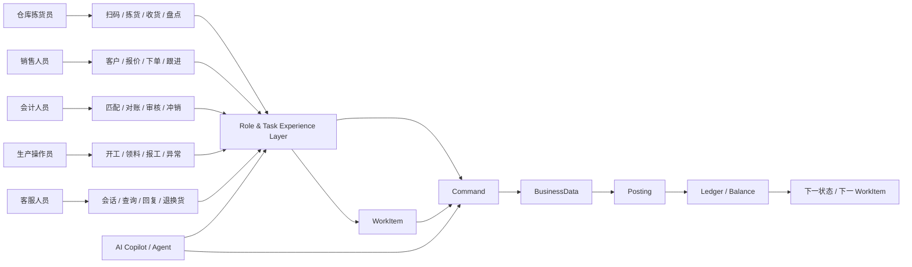
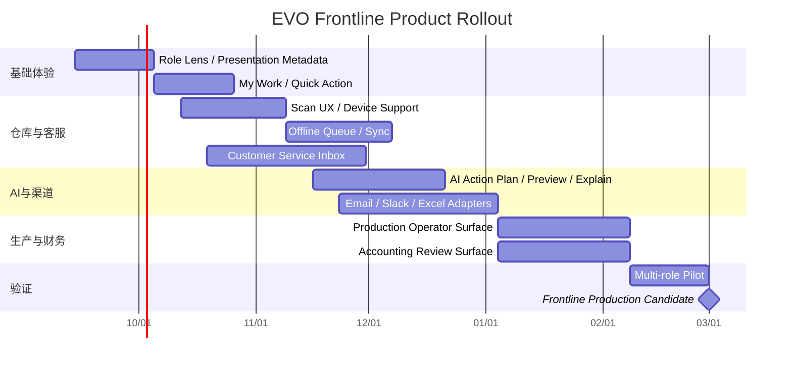

# EVO 面向一线员工的产品设计、市场定位与商业化研究

## 执行摘要

**核心结论：EVO 下一阶段最重要的产品变化，不是增加更多“ERP 模块”，而是在现有 Metadata → Command → BusinessData → Posting/Ledger → WorkItem 架构上增加一层真正面向一线人员的 `Role / Task Experience Layer`。**

EVO 对外不应只是：

> **AI-Native Enterprise Operating System**

更准确的产品承诺应该变成：

> **同一套企业事实，每个岗位一把趁手的工具。**  
> **One enterprise truth. A purpose-built tool for every role.**

这不是措辞变化，而是产品中心从：

```text
管理者
  ↓
Dashboard
  ↓
查看企业发生了什么
```

转向：

```text
一线员工
  ↓
完成一件工作
  ↓
EVO 自动形成企业事实
  ↓
Posting / Ledger / Workflow
  ↓
管理者自然得到实时经营视图
```

Odoo 已经把仓库 Barcode 做成专门的一线操作界面；NetSuite WMS 也把仓库收货、拣货、库存事务放到手持设备；Front 的核心不是“客服管理 Dashboard”，而是让客服围绕共享收件箱、工单、自动化和 AI 完成每一条客户工作；DOSS 把订单、库存、采购等操作聚合为运营系统；Campfire 则把对账、交易分类、异常检查等财务任务直接做成 AI 可执行/建议的工作。它们共同说明了一个规律：**一线采用率来自“任务完成体验”，而不是后台功能丰富程度。** citeturn4search0turn4search2turn4search6turn22view0turn22view4turn12view2

因此，我建议 EVO 明确形成两个产品层：

```text
                    EVO
                     │
        ┌────────────┴────────────┐
        │                         │
 System of Work              System of Record
 一线工作系统                  企业事实系统
        │                         │
 My Work                    Metadata
 Scan                       BusinessData
 Inbox                      Posting
 Quick Action               Ledger
 AI Copilot                 Replay
 Offline                    Audit
        │                         │
        └────────────┬────────────┘
                     │
                 Command
```

**对一线员工而言，EVO 不应该“像 ERP”。** 仓库员不应该打开“库存管理模块”，他应该看到“下一箱拣什么”；销售不应该研究“Customer / Order Object”，他应该看到“这个客户下一步应该做什么”；生产操作员不应该操作复杂 BOM 页面，他应该看到“开工、领料、报工、异常”；客服不应该在五个系统之间跳转，而应该围绕一个客户问题完成查询和动作；会计不应该面对 AI 黑盒自动记账，而应该看到“AI 建议什么、为什么、影响哪些账、如何撤销”。这与人机交互研究强调的“以人的需求和潜在 AI 失败模式为设计起点”一致。citeturn20view7turn8search0

**优先级最高的五项改动**是：

| 优先产品变化 | 价值 | 复杂度 |
|---|---:|---:|
| Role Lens + Quick Actions：按角色缩减界面 | 极高 | 低—中 |
| My Work：统一任务收件箱 | 极高 | 中 |
| AI Action Copilot：建议、预览、确认、解释、撤销 | 极高 | 中 |
| Work Where You Are：Email / Slack / Excel 等入口 | 高 | 中 |
| Scan + Offline Runtime：扫码、弱网、离线队列 | 极高，尤其仓库/生产 | 高 |

**商业模式上，我不建议 EVO 对所有一线人员采用传统 named-seat tax。** Front 当前仍采用 seat 订阅，并把部分 AI 功能作为附加收费；Frappe Cloud 则体现了按站点/算力而非纯用户数计费的另一条路线。EVO 更适合采用“**平台订阅 + 低成本/包含式 Task User + 专业用户席位 + 功能包 + AI Credits + 企业治理**”的混合模式，让客户增加仓库员、生产操作员、客服等使用者时，不产生明显的经济阻力。citeturn22view7turn14view1

### 本报告的明确假设

本报告假设 EVO 第一批目标客户仍是**约 20–500 人、业务变化较快、已有 Excel/SaaS/旧 ERP 混合环境的成长型企业**；优先覆盖你指定的五类角色：**仓库、销售、会计、生产、客服**。假设用户同时存在手机、桌面浏览器、仓库 Android 手持设备、车间平板/终端；仓库与车间存在间歇性网络；财务类高风险业务原则上在线确认；第一阶段不针对医疗、航空等极强行业合规场景做专门认证。现有一线数字化研究也提示，工具若只增加录入负担而不能立即帮助员工完成工作，容易被视为额外负担，因此 EVO 的一线价值必须首先体现在**减少步骤、减少切换、减少返工**，而不是“多收集数据”。citeturn19academia5turn19academia6


## 战略假设与角色任务地图

### EVO 应该优先优化“动作”，不是“模块”

五类角色虽然都在同一个企业中，但他们需要的是完全不同的交互模型。把 Metadata 动态渲染成一套“万能表单”仍然不够；Metadata 应该决定数据与命令的语义，而**任务模板决定一线人员如何完成动作**。Odoo Barcode、NetSuite WMS、Front Shared Inbox 和 Campfire 的产品形态都表明，专用任务表面比“通用 CRUD 页面”更适合高频操作。citeturn4search0turn4search6turn12view2turn22view5

| 角色 | 真正的一线任务 | 首选设备/入口 | EVO 应呈现的主界面 | 不应该首先呈现 |
|---|---|---|---|---|
| **仓库拣货员** | 收货、上架、拣货、复核、包装、移库、盘点、报告缺货/破损 | 手持扫描枪、Android、手机 | 当前任务 + 大按钮 + 扫码框 + 数量 + 下一库位 | Inventory Model、Ledger、复杂菜单 |
| **销售人员** | 查客户、库存承诺、报价、建订单、记录沟通、跟进、折扣审批 | 手机、Email、桌面 | 客户时间线 + 下一动作 + 快速报价/下单 | 后台 Metadata、Posting 配置 |
| **会计人员** | 匹配收付款、对账、异常审核、期间结账、冲销、解释差异 | 桌面、键盘优先 | Review Queue + 差异 + AI 建议 + Ledger Drill-down | 移动端大而全的 ERP 菜单 |
| **生产操作员** | 开工、领料、完工、报废、质检、停机原因、异常升级 | 工位平板、扫码枪、Kiosk | 当前工单 + 开工/报工/异常三个主要动作 | MRP 参数维护、完整 BOM 管理 |
| **客服人员** | 接收问题、识别客户、查订单/物流、回复、退款/退货/换货、升级 | Desktop Inbox，手机辅助 | Conversation + 客户上下文 + Action Panel | 独立销售/库存/财务模块 |

仓库场景已经有成熟的市场证明：Odoo Barcode 支持用条码驱动库存移动，ERPNext 官方文档也支持通过手机扫描条码增加 Item；NetSuite WMS 使用手持扫描设备执行入库、出库和库存事务。Campfire 则把 close checklist、flux analysis、account reconciliation 以及连续自动对账直接放在会计工作流中；Front 把邮件、SMS、社交、WhatsApp 等聚合到共享工作表面。citeturn21search1turn4search1turn4search2turn22view5turn22view8

角色到 EVO 核心的映射应该保持**五种 UX、一个业务执行内核**：



这里有一个非常关键的架构原则：

> **AI、Web、手机、扫码枪、Email、Slack、POS，都只是 Command 的不同入口。**

不能出现：

```text
Web 业务逻辑
AI 业务逻辑
扫码枪业务逻辑
Slack 业务逻辑
Excel 导入业务逻辑
```

五套实现。

应该始终是：

```text
任何入口
   ↓
ActorContext
   ↓
Permission
   ↓
Command Definition
   ↓
Validation
   ↓
BusinessData
   ↓
Posting / Workflow
   ↓
Audit
```

这正好发挥 EVO 当前 Metadata + Command + BusinessData 架构的价值。


## 一线体验与产品架构

### 首页应该从 Dashboard 变成 My Work

EVO 登录后不应默认显示十几个 KPI。

一线人员的默认入口应该只有四种能力：

```text
┌────────────────────────────┐
│ 早上好，王强               │
│ 今天还有 18 项工作          │
│                            │
│   [ 我的工作 ]             │
│                            │
│   [ 扫一扫 ]  [ 快速记录 ]  │
│                            │
│   [ 问 EVO ]               │
└────────────────────────────┘
```

管理者仍然可以得到 Dashboard，但 Dashboard 应是**一线工作形成的数据的派生视图**，而不是全系统的 UX 中心。Front 的共享收件箱模式和 DOSS 的统一订单队列都体现了这种“queue-first”思路：用户先面对需要处理的工作，而不是先面对组织结构和数据库结构。DOSS 当前明确描述把来自不同渠道的订单放进一个队列再自动路由、拆单和分配。citeturn22view1turn12view2

### Metadata 需要增加 Presentation Metadata

当前 EVO 的 Metadata 很适合描述：

```text
Entity
Field
Command
Rule
```

下一阶段应该增加：

```text
TaskViewDefinition
RoleLens
FieldPresentation
QuickAction
InteractionHint
```

例如一个 Quantity 字段不仅应知道：

```json
{
  "type": "decimal",
  "required": true
}
```

还应能够表达：

```json
{
  "interaction": "scan-or-keypad",
  "role": "warehouse-picker",
  "prominence": "primary",
  "largeTouch": true,
  "unitVisible": true,
  "offlineWritable": true
}
```

这样 Metadata 仍是系统事实，但前端不需要把所有业务对象都渲染成相同的表单。

### Progressive Disclosure 必须成为默认原则

仓库拣货时只显示：

```text
库位
SKU
图片
需要数量
已扫数量
异常
```

不要同时显示：

```text
标准成本
采购供应商
会计科目
需求计划
Posting Rule
历史价格
创建者
Metadata Version
```

Nielsen Norman Group 的复杂应用设计指导和 progressive disclosure 原则都强调，把当前任务不需要的信息延后显示可以降低复杂性；Apple 的 disclosure 模式同样用于按需要揭示附加信息。citeturn21search3turn7search0turn7search1

EVO 应采用：

```text
当前动作
   ↓
必要字段
   ↓
异常时才出现异常字段
   ↓
“更多详情”
   ↓
完整企业数据
```

而不是：

```text
完整数据模型
   ↓
让用户自己找需要的字段
```

### Mobile-first 不等于所有岗位都手机化

**仓库和生产**应是 scan/mobile/tablet-first；**销售**应 mobile + Email-first；**客服和会计**应 desktop/keyboard-first，手机作为辅助。真正的 mobile-first 是“首先按照用户工作发生的现场来设计”，而不是强迫会计在 6 英寸屏幕上做银行对账。

触控区域至少应遵守主流无障碍规范所要求的足够尺寸；Android 官方无障碍指导长期推荐约 48dp 的触控目标，WCAG 2.2 也增加了 Target Size 等相关要求。对于戴手套的仓库和生产场景，我建议 EVO 内部把主要操作按钮提高到 **56–64dp**；这是 EVO 自己的目标，而不是 WCAG 的硬性数值。citeturn7search15turn20view6

### Micro-interaction 要代替页面跳转

一次正常仓库扫描应是：

```text
扫描
↓
<100ms 本地反馈
↓
✓ 声音
✓ 震动
✓ 数量 +1
✓ 下一库位
```

而不是：

```text
扫描
↓
提交
↓
Loading
↓
整个页面刷新
↓
弹窗
↓
点确定
↓
回任务
```

Google 的 Core Web Vitals 把良好的交互响应 INP 目标设为 200ms 以内、LCP 目标为 2.5 秒以内；而一线扫码这种高度重复操作需要比通用网页指标更严格，因此我建议 **本地扫描反馈 p95 <100ms**，服务器在线 Command acknowledgement **p95 <500ms**。后两个是 EVO 的产品工程目标，而非 Google 的通用阈值。citeturn21search2

建议的性能预算：

| 动作 | EVO 内部目标 | 原因 |
|---|---:|---|
| 扫码后声音/震动/UI 更新 | **p95 <100ms** | 高频动作必须近似即时 |
| 普通在线 Command 确认 | **p95 <500ms** | 不打断工作节奏 |
| My Work 暖启动 | **<1s** | 班次频繁进入 |
| Web INP | **≤200ms** | 对齐良好 Web UX 基线 |
| 冷页面 LCP | **≤2.5s** | 对齐 Core Web Vitals |
| 恢复联网后的普通离线队列同步 | **绝大部分 5s 内** | 用户无需等待后续工作 |

这里所有 p95/<1s/5s 数值除 Core Web Vitals 外均应视为**EVO 产品目标，需要以后用真实客户设备验证**。citeturn21search2

### Offline-first 应只用在真正需要的地方

Android 官方 offline-first 架构建议把本地数据作为关键读取来源，使应用在网络不可持续可用；仓库和工厂恰好属于这种环境。Odoo 也已经把离线/低延迟扫描作为库存产品体验的一部分。citeturn21search0turn4search4

但 EVO 不应简单允许“所有 Command 离线执行”。

建议按风险分类：

| 动作 | 离线能力 |
|---|---|
| 拣货扫描 | 可 |
| 收货扫描 | 可 |
| 生产报工 | 可 |
| 盘点 | 可 |
| 客服写草稿 | 可 |
| 销售现场记录 | 可 |
| 高额折扣批准 | 默认不可 |
| 财务正式 Posting | 默认不可 |
| 期间关闭 | 不可 |
| 权限修改 | 不可 |

离线写入必须至少具有：

```text
clientMutationId
deviceId
commandVersion
actorId
localSequence
createdAt
expectedVersion
```

后台必须做：

```text
Idempotency
+
Conflict Detection
+
Canonical Ordering
+
Replay-safe execution
```

这和 EVO 已经建立的 Posting/Replay 思路天然一致。


## AI、权限、集成与可靠性

### AI 不应该一上来就“自动干所有事情”

最合理的是一个逐级自治模型：

| AI 等级 | 用户体验 | 示例 | 默认策略 |
|---|---|---|---|
| **理解** | AI 帮你找、读、总结 | “这个客户为什么还没发货？” | 自动 |
| **辅助** | AI 预填内容 | 根据邮件生成销售订单草稿 | 自动生成、人工确认 |
| **建议** | AI 推荐下一动作 | “建议部分发货，剩余延期” | 人工确认 |
| **执行** | AI 发出已授权 Command | 自动创建补货任务 | 可撤销低风险动作 |
| **自治** | Agent 连续完成多步工作 | 识别缺货→询价→生成采购建议→等待批准 | 规则、预算、权限边界内 |

Microsoft Research 的 HAX Toolkit 把 AI 产品设计建立在潜在失败、用户控制和人机交互指导之上；Google PAIR 也强调校准信任、解释和以用户为中心的 AI。Campfire 当前的模式很值得 EVO 参考：一方面进行自动交易分类和连续 reconciliation，另一方面仍提供分组、建议动作和人工 review，而不是把“AI”简单等同于不可见的后台自动化。citeturn20view7turn8search0turn22view4

### AI Action 应当成为 EVO 的一级对象

我建议后台新增：

```text
AIActionPlan
├── intention
├── sourceFacts[]
├── proposedCommands[]
├── expectedEffects[]
├── confidence
├── permissionEvaluation
├── riskLevel
├── requiresApproval
└── undoPolicy
```

用户看到的不是：

> “AI 已完成。”

而应该是：

```text
EVO 建议：
把订单 SO-1028 从 100 件改为两批发货

原因：
• A 仓现有可用库存 60
• 下一批预计 9 月 14 日到货
• 客户 SLA 允许分批

将发生：
• 创建 Shipment 60
• 剩余 Backorder 40
• 创建客户通知草稿

[查看依据]   [执行]   [修改]
```

执行后：

```text
✓ 已完成

查看影响
撤销 / 冲销
```

这才叫**可解释 AI + 可操作 AI**。

### Undo 不能破坏 Ledger

这里 EVO 有一个比普通 SaaS 更强的机会。

对于尚未形成会计/库存事实的低风险 UI 操作：

```text
Undo
↓
撤销 Command / WorkItem 状态
```

但如果已经产生 Ledger：

```text
原 Command
↓
BusinessData
↓
Posting
↓
Ledger
```

则 UI 上虽然仍可以写“撤销”，后台实际应该：

```text
Compensating Command
        ↓
Reversal BusinessData
        ↓
Reversal Posting
        ↓
Ledger 保留原历史
```

也就是说：

> **用户可以撤销自己的错误，但企业历史不能被悄悄改写。**

这正是 EVO 的 Posting/Ledger/Replay 架构可以转化成产品优势的地方。

### AI 必须继承权限，而不是拥有“AI 超级权限”

建议权限制成：

```text
User Permission
       ∩
Agent Permission
       ∩
Command Permission
       ∩
Object / Row Policy
       ∩
Field Visibility
       ∩
Risk / Approval Policy
```

例如仓库员工可以知道：

```text
SKU
位置
可拣数量
批次
```

但不一定需要看到：

```text
采购成本
毛利率
供应商付款条件
总账科目
```

销售可以看到客户信用状态，但成本和利润字段可由企业决定；客服可看到订单与物流，却不必看到成本账；生产人员看到工艺要求而无需知道销售价格。Campfire 已把“roles、approval workflows、1,200+ granular permissions”作为其财务 ERP 能力之一，Front 企业版也提供 custom roles/permissions；这说明现代 AI 企业软件仍然必须把 granular permission 当成核心能力，而不是 AI 之后再补的附件。citeturn22view3turn22view8

AI Actor 应始终记录：

```text
actorType = AI
agentId
onBehalfOfUserId
model/provider
actionPlanId
commandId
permissionSnapshot
sourceReferences
```

从而可以回答：

> 谁让 AI 做的？  
> AI 当时能看什么？  
> 为什么做？  
> 做了哪些 Command？  
> 哪些 Ledger 由此产生？  
> 如何反向追溯？

### 集成的目标是“让工作进入 EVO”，而不是复制另一个 App

EVO 不应该要求：

> “以后所有人停止使用 Email / Slack / Excel。”

而应做到：

```text
已有工作入口
    ↓
EVO 识别上下文
    ↓
展示 / 建议 Action
    ↓
同一个 Command Bus
```

Slack 的 Workflow Builder 已支持无代码工作流及自定义 workflow step；Microsoft Graph 提供程序化 Excel workbook/session 操作；Square 等 POS/commerce API 提供 Orders、Catalog、Inventory、Locations、Webhook 等业务接口；GS1 的二维条码体系也建立在标准化商品标识与 POS/扫描设备读取之上。这使 EVO 完全可以把这些工具视为“渠道适配器”，而不是独立业务系统。citeturn17search1turn17search0turn17search2turn17search5

建议第一代集成模型：

| 外部工具 | EVO 行为 | 用户不需要做什么 |
|---|---|---|
| **Email** | 识别客户/供应商/订单；形成 WorkItem；AI 草拟回复或 Command | 不用复制邮件内容到 ERP |
| **Slack** | 通知 + 交互式审批/Action Link | 不用回 ERP 找审批单 |
| **Excel** | Mapping → Preview → Validation → Command batch | 不直接写数据库 |
| **条码扫描枪** | Keyboard wedge / native scan → Quick Command | 不填写商品编码 |
| **POS** | Webhook → IntegrationInput → Command / BusinessData | 不手工重录销售 |
| **未来中国渠道** | 企业微信/飞书/钉钉作为同一 Channel Adapter | 不另建业务逻辑 |

Excel 尤其不能采用：

```text
Excel
↓
直接 UPDATE 数据库
```

而必须：

```text
Excel
↓
Import Preview
↓
Validation
↓
Command[]
↓
BusinessData
↓
Posting
```

这样 Excel 仍然是员工熟悉的工具，但不会绕开 EVO 的审计边界。

### Onboarding 应以“完成第一件工作”为结束点

不要先让员工观看一小时培训。

第一天应该：

```text
扫码 / 邀请登录
↓
EVO 自动识别岗位
↓
看到一个模拟任务
↓
30–90 秒完成
↓
进入真实 My Work
```

Front 当前甚至把 tailored onboarding/training 作为企业服务内容，说明复杂业务软件仍然需要结构化采用支持；EVO 的优势应该是把这种培训进一步嵌入任务本身，而不是依赖课堂。citeturn14view2

建议记录：

```text
Time to First Completed Task
```

而不是：

```text
Time to First Login
```

前者才代表用户真正开始获得价值。

### 错误恢复必须比“错误提示”更进一步

好的异常应该是：

```text
✕ 扫描到 SKU B

当前任务需要 SKU A。

[重新扫描]
[报告库位错误]
[申请替代品]
```

而不是：

```text
Error code 40193
Invalid inventory transaction
```

WCAG 2.2 对错误识别、错误建议、状态信息、避免重复输入等都有明确可访问性要求；EVO 应把这些原则进一步扩展到业务错误恢复。citeturn20view6

后台审计建议统一记录：

```text
AuditEvent
├── actor
├── actorType
├── device
├── channel
├── command
├── previousState
├── intendedChange
├── actualChange
├── businessData
├── postingRun
├── ledgerEntries
├── aiActionPlan
├── error
└── correction / reversal
```

### 本地化不能只是翻译菜单

EVO Metadata 应允许：

```text
标准术语：
Customer

中国企业 A：
客户

中国企业 B：
经销商

特定业务：
门店客户
```

也就是说，本地化至少有三层：

```text
Platform Locale
↓
Country / Industry Pack
↓
Enterprise Vocabulary Overlay
```

日期、时区、币种、数量单位、地址、税号等也必须是结构化 locale capability。视觉和交互层建议以 **WCAG 2.2 AA** 为产品基线，包括键盘访问、焦点可见、目标尺寸、错误识别、状态消息等；W3C 当前将 WCAG 2.2 作为正式 Recommendation，并明确适用于包括移动、桌面等多种 Web 场景。citeturn20view6


## 竞争格局与商业模式

EVO 真正应该学习的不是某一个 ERP，而是**四类产品各自最擅长的部分**：Odoo/ERPNext 的灵活业务模块与扫码操作、NetSuite 的企业交易深度、DOSS/Campfire 的 AI-native 运营/财务思路、Front 的一线任务收件箱体验。citeturn4search0turn4search1turn4search6turn22view0turn22view5turn12view2

| 属性 | Odoo / ERPNext | NetSuite | DOSS / Campfire 类 AI ERP | Front |
|---|---|---|---|---|
| **核心定位** | 模块化 ERP / 开源或可扩展企业套件 | 综合云 ERP | DOSS 偏消费品运营；Campfire 偏 AI-native 财务 | 客户运营 / 客服工作平台 |
| **一线任务 UX** | **较强**，尤其库存 Barcode；ERPNext 也支持手机扫码 | **较强于 WMS 场景**，手持终端执行仓库任务 | **较强但岗位较集中**：DOSS 运营、Campfire 财务 | **非常强**，共享 inbox / ticket / workflow 是核心 |
| **移动/扫码** | Odoo 仓库条码能力突出；部分库存操作强调离线体验 | WMS Mobile + handheld scanner | 官网重点更多在数据、运营、AI，offline-first 不是主要公开卖点 | 移动客户端有，但不是工业扫码产品 |
| **Offline-first** | **相对领先**于 warehouse 场景 | 官方 WMS 重点是 mobile/real-time；所查页面未把 offline-first 作为核心承诺 | 所查公开产品页面未突出 | 所查产品页面未突出 |
| **AI 辅助** | ERP AI 能力逐步增加，但传统模块仍是 UX 主体 | 企业 ERP AI 在扩展 | **核心卖点**：DOSS chat/query/automation；Campfire 自动分类、对账、建议动作 | **核心能力之一**：Copilot、QA、CSAT、Autopilot |
| **工作队列** | 各模块自己的操作流 | 模块/角色中心 | DOSS 明确统一订单队列；Campfire review/close 流 | **核心产品模式** |
| **权限/治理** | 企业 ERP 传统权限 | 企业级权限成熟 | Campfire 宣称 1,200+ granular permissions | Enterprise 有 custom roles/permissions |
| **集成** | 广泛应用生态 | 广泛企业集成 | Campfire 宣称 100+ native integrations；DOSS 有 integrations 产品 | Email/SMS/social/WhatsApp/API 等 |
| **EVO 应学习** | Barcode、模块可配置性 | 交易完整性、企业可靠性 | AI 直接进入业务动作 | Inbox、queue、低摩擦协作 |
| **EVO 的机会** | 把“模块”进一步变成“角色工作 App” | 用 Metadata 降低实施与变化成本 | 从垂直 AI ERP 扩展到统一可演化业务内核 | 给优秀一线 UX 补上真正的 BusinessData + Posting + Ledger |

Odoo 官方文档确认其 Barcode 可用于产品/包装识别和库存移动；ERPNext 官方也提供手机扫码 Item 的能力；NetSuite WMS 官方资料明确将 handheld barcode scanner 用于 inbound/outbound/inventory 操作。citeturn21search1turn4search1turn4search2

DOSS 当前直接把自己定位为“消费品的 AI-native operating system”，覆盖 inventory、procurement、order management、finance/accounting、warehouse management、production planning 等；还把跨渠道订单汇聚并自动 route/split/allocate。Campfire 则强调 AI 自动分类、continuous reconciliation、建议动作、细粒度权限和 100+ native integrations。以上均是供应商自己的当前产品表述，应视作产品能力声明而非独立效果验证。citeturn22view0turn22view1turn22view3turn22view4

Front 提供 shared inbox、ticketing、omnichannel、workflow automation、AI Copilot/Autopilot 和企业权限。它对 EVO 最有价值的启发其实不是“客服功能”，而是：

> **复杂的后台数据，不代表一线界面必须复杂。**

Front 可以把大量客户上下文隐藏在一个 Conversation 周围；EVO 也应该把订单、库存、BusinessData、Ledger、WorkItem 隐藏在一个“当前工作”周围。citeturn22view6turn22view8

### 对外定位建议

我建议 EVO 的市场定位分两层。

面向 CTO / 管理层：

> **EVO — AI-Native Enterprise Operating System**  
> 一个由 Metadata 驱动、可持续演化、可重放、可审计的企业运行系统。

面向真实用户和商业营销：

> **EVO — 不让员工学习 ERP，让 ERP 学会员工怎么工作。**

或者更克制的企业版本：

> **One enterprise truth. The right tool for every role.**  
> **同一套企业事实，每个岗位一把趁手的工具。**

这样的定位可以明显区别于“又一个 AI Dashboard”。

### 商业模式不应阻碍一线采用

Front 当前年度订阅价格从 Starter **$25/seat/month**、Professional **$65/seat/month** 到 Enterprise **$105/seat/month**，同时把部分 AI 能力作为附加能力或高阶计划内容；这是典型的现代 seat + AI/feature 混合模式。citeturn22view7turn22view6

对 EVO，我建议不要照搬。

更合适的是：

| 收费层 | 建议 |
|---|---|
| **EVO Platform** | 按企业/法人、数据规模、环境与基础 Runtime 收费 |
| **Task User** | 仓库员、生产员、基础客服等按 MAU 档位大量包含，边际价格极低 |
| **Professional User** | 会计、计划、销售高级用户、管理员、Builder 按 seat |
| **Business Pack** | WMS、Manufacturing、Finance、Service 等能力包 |
| **AI Credits** | AI 推理/动作消费量，可包含基础额度 |
| **Enterprise Governance** | SSO、数据驻留、高级审计、策略、SLA、私有模型、专有部署 |
| **Marketplace** | 模板、Agent、Integration、行业包收入分成 |

理由不是“seat 计费不好”这么简单，而是：

```text
更多一线员工使用 EVO
        ↓
产生更完整、及时的 BusinessData
        ↓
Ledger / Workflow 更准确
        ↓
AI Context 更好
        ↓
管理价值更高
```

因此对每一个仓库员额外收取高额 named-seat，本质上可能是在给 EVO 自己最重要的网络效应制造摩擦。这是基于 EVO 产品机制的商业推论，而不是市场通行定律。作为对照，Frappe Cloud 已经体现出以站点/服务器/算力作为商业计量维度、而非只按 named seat 定价的路径。citeturn14view1

AI Credits 也不应暴露原始 token。

客户应该看到：

```text
AI Credits
│
├── Assist
├── Extraction
├── Recommendation
├── Autonomous Action
└── High-compute Analysis
```

后台再映射：

```text
OpenAI / Anthropic / Google / Local
tokens
tool calls
compute
```

这让 EVO 可以以后提供 BYOM（企业自带模型）而不破坏产品计费层。

一个更有战略价值的方向是：**AI 费用本身也进入 EVO Ledger**。

例如：

```text
采购 Agent
├── 本月执行：12,420 个任务
├── AI 成本：$1,840
├── 自动完成：10,730
├── 人工升级：1,690
├── 撤销：43
└── 每个成功任务成本：$0.17
```

届时 EVO 不只是“提供 AI Agent”，还可以成为企业管理 **AI Workforce economics** 的系统。


## 优先产品改动

下面五项不是“大而全重做前端”，而是按**低投入、高行为改变、高可验证性**排序。复杂度是相对于 EVO 当前已有 Metadata、Command、BusinessData、Posting/Ledger、WorkItem 基础而言。

| 产品改动 | 具体行为 | 复杂度 | 需要的 Backend 变化 | 验证假设 |
|---|---|---:|---|---|
| **Role Lens + Quick Actions** | 登录后只显示该岗位最常用字段和 3–6 个主要动作；更多信息 progressive disclosure | **低—中** | Metadata 增加 `RoleLens`、`FieldPresentation`、`QuickAction`、locale label；field-level visibility | 可见字段减少 ≥50%，新人完成主要任务无需导航模块 |
| **My Work Task Inbox** | 所有人从“今天要处理什么”进入；支持 Assigned / Ready / Blocked / Exception | **中** | WorkItem projection、role routing、priority/SLA、task status、deep-link Command | ≥80% 日常动作可从 My Work 发起，导航步骤下降 ≥30% |
| **AI Action Copilot** | AI 总结→建议→预填→显示影响→一键确认；执行后可 Explain/Undo | **中** | `AIActionPlan`、Command Preview、permission evaluation、provenance、risk policy、reversal mapping | AI 建议接受率 ≥40%，0 权限越权，低风险 AI 导致的撤销率 <5% |
| **Work Where You Are** | Email/Slack 中直接查状态、批准、转 WorkItem；Excel 可安全导入 | **中** | Integration Adapter、ExternalThreadRef、OAuth、Webhook idempotency、Import Preview、Outbox | 试点用户上下文切换次数下降 ≥25% |
| **Scan + Offline Runtime** | 扫码立即反馈；断网继续收货/拣货/盘点/报工；联网自动同步 | **高** | clientMutationId、DeviceSession、local sequence、sync checkpoint、conflict API、idempotency、barcode mapping | 1000 次离线测试零重复；本地扫描 p95<100ms；同步成功率 ≥99.9% |

这些指标是**建议的产品验收目标**，并非外部行业平均值。offline-first 的架构依据来自 Android 官方对本地数据与离线可靠性的建议；低交互延迟则参照 Core Web Vitals 的交互性能方向，并针对工业高频动作设置更严格的 EVO 内部预算。citeturn21search0turn21search2

### 最值得立刻做的是 Role Lens

它对后端改动最少，却能改变整个产品的感觉。

例如现在销售订单可能有：

```text
52 个字段
```

销售人员创建订单时实际只需要：

```text
客户
产品
数量
价格
交货时间
备注
```

其余：

```text
税
会计
Posting
Fulfillment
Cost
Metadata
System fields
```

由默认值、规则、AI、后续流程或 progressive disclosure 处理。

因此：

> **Metadata-driven 绝不能等于 Metadata-exposed。**

这是 EVO 产品设计中非常重要的一句话。

### My Work 是 EVO 从 ERP 变成 Operating System 的关键

如果 EVO 真的是 Enterprise Operating System，那么第一屏理论上不应该问：

> “你想打开哪个模块？”

而应该知道：

> “你现在应该做什么？”

也就是说：

```text
Metadata 定义世界是什么
BusinessData 记录发生了什么
Ledger 记录业务效果
Workflow 决定下一步
WorkItem 决定谁来做
Role Lens 决定他看到什么
AI 帮助他更快完成
```

当这六层真正接起来后，“Operating System”这个定位才从架构概念变成普通员工可以感受到的产品。


## 上线节奏与用户验证

我不建议一次把五种岗位全部做到“完善”，但也不建议再按过去那种 M4、M5、M6 每个基础模块逐个等待人工确认。

更高效率的方法是**纵向切片**：每一阶段都让真实岗位能完成完整业务。

建议从 **2026 年 9 月中旬开始，约六个月达到 Frontline Production Candidate**：



### 第一波：角色壳与 My Work

**时间：约 6 周。**

目标不是漂亮，而是证明：

```text
用户不需要知道 EVO 的模块结构
就能完成日常工作
```

第一波建议同时做一个仓库场景、一个客服场景和一个销售场景，因为它们对“任务化体验”的验证最直接；会计则同步验证权限和 AI review 机制。

Go/No-Go 指标：

| 指标 | 第一阶段目标 |
|---|---:|
| 首次登录到完成第一件任务 | **<10 分钟** |
| 核心任务无需帮助完成率 | **≥85%** |
| My Work 发起核心动作占比 | **≥70%** |
| 用户需要进入传统模块导航的次数 | 相比基线 **下降 ≥30%** |
| 关键 Command 可审计率 | **100%** |

这些均为 EVO 试点目标，需要通过真实样本建立基线后再调整。

### 第二波：仓库 Offline + 客服 Inbox

**时间：约 8 周，可与前一阶段后半段并行。**

仓库验证：

```text
收货
↓
上架
↓
拣货
↓
错误扫描
↓
断网
↓
继续拣货
↓
恢复网络
↓
正确同步
↓
Posting / Ledger 正确
```

客服验证：

```text
Email
↓
客户识别
↓
订单上下文
↓
AI 摘要
↓
建议动作
↓
回复 / 退货 Command
↓
WorkItem 完成
```

Odoo 和 NetSuite 已证明扫码/手持设备是成熟仓库交互形态，Front 则证明 shared inbox + workflow automation 对客服场景具有成熟产品范式，因此这两条 vertical slice 的市场和 UX 风险相对较低。citeturn21search1turn4search2turn22view8

### 第三波：AI Copilot 与渠道

AI 的验证重点不是“回答得聪不聪明”，而是：

```text
建议是否正确？
↓
用户是否理解？
↓
是否愿意采用？
↓
有没有越权？
↓
出错能不能恢复？
↓
最终企业事实是否正确？
```

建议同时记录：

| AI 指标 | 意义 |
|---|---|
| Suggestion Acceptance Rate | AI 是否真正有用 |
| Suggestion Edit Rate | AI 离正确答案有多远 |
| Undo / Reversal Rate | AI 是否制造返工 |
| Human Escalation Rate | 自治边界是否合适 |
| Permission Rejection Rate | Agent 是否经常试图越界 |
| Explain View Rate | 用户是否需要理解依据 |
| AI Cost per Successful Task | AI 的真实单位经济性 |

Campfire 当前的自动 reconciliation + suggestion/review 组合以及 Front 的 Copilot 与 Autopilot 分层，都支持“辅助与自治并存而非全部黑盒自动化”这一产品方向。citeturn22view4turn22view6

### 第四波：生产、会计与多角色闭环

这时应该验证真正的 EVO：

```text
销售创建订单
      ↓
库存不足
      ↓
产生生产需求
      ↓
生产操作员 My Work
      ↓
领料 / 报工
      ↓
库存 Ledger 更新
      ↓
仓库产生发货 WorkItem
      ↓
发货
      ↓
应收产生
      ↓
会计 WorkItem
      ↓
客户来问订单
      ↓
客服看到完整状态
```

**五种岗位不需要学习彼此的模块，但操作的是同一个企业事实系统。**

这应成为 EVO v1.0 前最重要的产品验收场景。

### 一线采用和生产力指标

不要以：

```text
Dashboard Views
Page Views
AI Messages
```

作为核心成功指标。

建议 EVO 内建以下指标：

| 维度 | 全局指标 | 岗位指标 |
|---|---|---|
| **采用** | Frontline WAU / Provisioned Users、7/30 日留存、My Work 使用占比 | 各岗位重复使用率 |
| **效率** | Task completion time、操作次数、上下文切换次数 | 仓库 lines/hour；销售订单录入时长；客服 handle time |
| **质量** | Error/rework、reversal rate、异常率 | 错拣率、订单修改率、错误报工率、会计调整率 |
| **可靠性** | p95 latency、crash-free session、offline sync success | 扫码反馈时间 |
| **AI** | acceptance、edit、undo、escalation | 每岗位 AI 成功任务成本 |
| **采用成本** | Time to First Task、help requests | 新人达到正常效率需要几天 |
| **企业结果** | WorkItem cycle time、backlog、SLA | close time、first response、order cycle 等 |

真正的 North Star 候选，我建议使用：

> **Successful Work Completed Through EVO per Active Employee**

并辅以：

> **Median Time per Successful Work**

因为第一个防止系统只是“有人登录”，第二个防止 EVO 成为新的行政负担。

### 简单原型测试脚本

第一轮无需大样本。建议找 **每个岗位约 3–5 名真实或高度相似用户**进行发现性测试；这不是为了统计显著性，而是快速发现高频 UX 失败。后续是否上线应依靠更大的实际试点数据，而不是仅靠这批可用性访谈。

测试人员在开始前只听一句：

> “这是你今天工作的系统。请像平时一样完成任务。遇到问题先不要问我，告诉我你认为应该怎么做。”

然后执行：

| 角色 | 原型任务 | 故意放入的异常 | 成功标准 |
|---|---|---|---|
| **仓库员** | 从 My Work 打开拣货单，扫描 3 个 SKU 并完成 | 第二件故意扫描错误 SKU；中途断网 | 自己发现错误并恢复；断网仍继续；恢复后无重复 |
| **销售** | 从一封客户邮件创建报价并提交 10% 折扣 | AI 识别一个数量需人工确认 | 找到 AI 建议、能修改、知道审批去了哪里 |
| **会计** | 匹配一笔银行流水与发票 | AI 给一个不确定匹配 | 能理解建议依据、拒绝错误建议、找到 Audit |
| **生产** | 扫工单开工、领料、报 95 良品 + 5 报废 | 报废触发原因字段 | 无需寻找菜单；异常字段只在需要时出现 |
| **客服** | 回答“我的订单为什么没发完？”并创建后续动作 | 实际是 60 已发、40 缺货 | 能在一个界面理解状态；AI 回复不承诺错误日期 |

每次任务自动采集：

```text
task_started
time_to_first_action
taps/clicks
navigation_count
help_requested
error
recovery
task_completed
task_duration
ai_suggestion_shown
ai_accept/edit/reject
undo
permission_denied
```

观察员再记录四个问题：

> “刚才最让你犹豫的地方是什么？”  
> “你觉得系统下一步应该自动替你做什么？”  
> “有什么信息你觉得不应该给你看？”  
> “如果明天必须用它工作，你最担心什么？”

最后让用户用 1–7 分评价：

```text
完成这件事有多容易？
你有多确定结果是对的？
你有多信任刚才 AI 的建议？
发生错误时，你是否知道如何恢复？
```

正式进入试点前，我建议设以下最低门槛：

```text
核心任务成功率                    ≥ 90%
未经帮助成功率                    ≥ 85%
关键错误可恢复率                  ≥ 95%
关键业务写操作 Audit coverage     = 100%
AI 权限越界                       = 0
Offline duplicate transaction     = 0
本地扫码反馈 p95                  < 100ms
在线常规 Command p95              < 500ms
```

这些是**EVO 自己的发布门槛建议**，不是行业统一标准；其中网页体验的大方向可参考 Core Web Vitals，offline-first 架构可参考 Android 官方指导，无障碍要求则应至少以 WCAG 2.2 AA 为目标。citeturn21search2turn21search0turn20view6

最终，EVO 面向一线人员的产品原则可以浓缩成一句话：

> **不要让员工操作企业软件的内部结构；让他们只完成自己的工作，而 EVO 在背后维护企业的结构、事实、账本、流程与智能。**

这会把 EVO 现有最有价值的技术设计——Metadata、Command、BusinessData、Posting、Ledger、Replay、Workflow、AI Actor——从“漂亮的后台架构”转化成一个非常具体的竞争优势：

```text
传统 ERP
用户学习系统
    ↓
寻找模块
    ↓
填写系统需要的数据
    ↓
企业得到记录


EVO
系统理解岗位
    ↓
给用户当前工作
    ↓
用户完成自然动作
    ↓
EVO 自动形成 BusinessData
    ↓
Posting / Ledger / WorkItem
    ↓
AI 理解最新企业状态
    ↓
帮助下一位员工继续工作
```

**这应该成为 EVO 的最终产品方向：管理层看到的是 Enterprise Operating System，而一线员工感受到的只是“一把特别好用的工具”。**